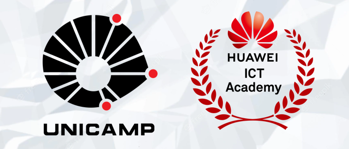

 <h1 align="center">
  
</h1>

<h1 align="center">UNICAMP - Huawei ICT Academy (HCIA-IA)</h1>

## Description

Artificial intelligence
- Overview, Introduction to Colab and Review of Python Basics, Fields and Applications, Using Arrays with NumPy, Overview of Huawei Strategies for AI, Data Analysis with Pandas, AI Controversies, Data Visualization with Matplotlib and Seaborn.

Machine Learning
- Definition, Types, Processes, KNN, K-Means, Hierarchical clustering, Perceptron, Other key machine learning methods, Linear Regression, Ridge Regression, Lasso Regression, Polynomial Regression, Logistic Regression, Naive-bayes, Decision tree, SVM, Ensemble learning.

Deep Learning (DL)
- Introduction to deep learning, Training rules, Activation functions, Normalization strategies, Optimizers, Types of deep neural networks.

Huawei CLOUD
- HUAWEI CLOUD EI Overview, ModelArts, Solutions with Huawei CLOUD EI.

Frameworks for DL
- Pytorch, exposition and demo, Tensorflow, features, Tensors in Tensorflow, Variables in Tensorflow, Basic operations in Tensorflow, Tensorflow 1.0 versus Tensorflow 2.0, Graphs and sessions, Demo, Autograph, Eager Execution in Tensorflow 2, Common Tensorflow modules, Demo, Common Tensorflow Modules , Demo, Keras: Model Assembly, Advantages, Methods and Interface , Demo.

Ascend Architecture
- AI Chips, Hardware & Software Architecture of Ascend Chips, Huawei Atlas AI Computing Platform, Industry Applications of Atlas.

Mindspore
- Overview, Development Framework, Architecture, Main features, Development and applications.

Huawei's Open AI Platform for Smart Devices
- AI Industrial Ecosystem, Huawei AI Platform, App Development based on Huawei AI Platform.

### 🛠 Technologies

The following tools were used in the construction of the project:

- [Python](https://www.python.org/)
